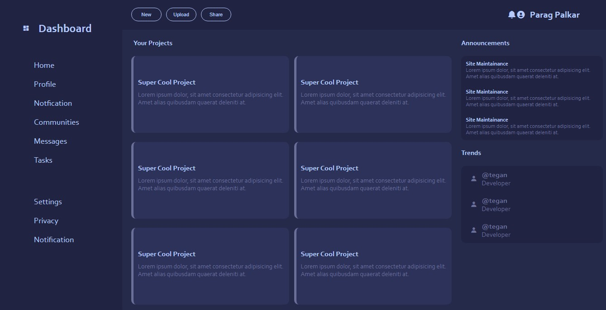

# Admin Dashboard

Welcome to the Advanced Admin Dashboard project! This repository contains a powerful and responsive admin dashboard built using cutting-edge web technologies such as HTML, CSS, CSS Grid, and Flexbox. This project aims to showcase the capabilities of these advanced techniques in creating modern and efficient user interfaces.

## Demo

https://paragpalkar.github.io/frontend_dashboard/

## Features

- CSS Grid Layout
- Flexbox for Components
- Fullscreen mode
- User-Friendly Interface

## Tech Stack

## Preview

## Contributing

Contributions are always welcome! Contributions to this project are welcome! If you find any issues or want to enhance the dashboard further, feel free to create pull requests.

